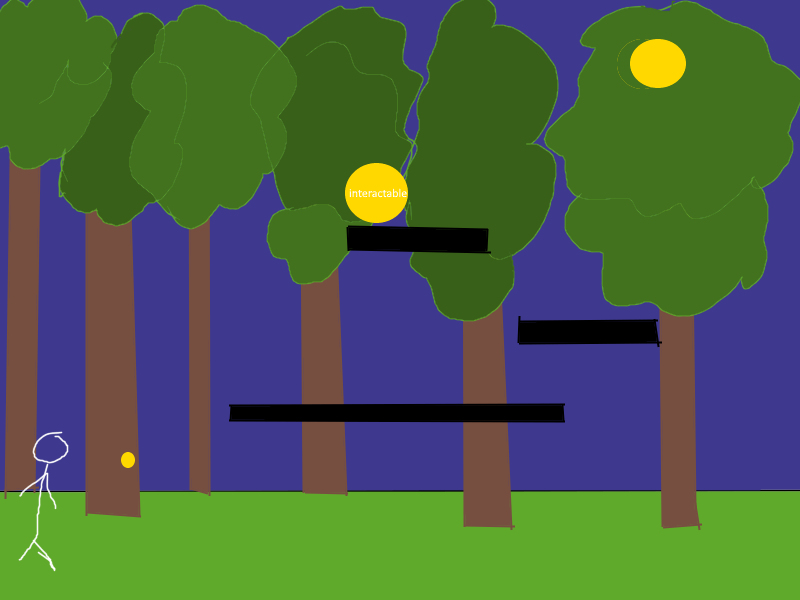

:warning: Everything between << >> needs to be replaced (remove << >> after replacing)

# << Project Title >>
## CS110 Final Project  << Semester, Year >>

## Team Members

<< List team member names >>

Emily Scott
***

## Project Description

<< Give an overview of your project >>
I am going to be making a scroller game with native plants & wildlife from the adirondack park, where the user interacts with objects to learn about them. Interacting with an object gives the user a unique item and when they collect them all they win the game.
***    

## GUI Design

### Initial Design

### Final Design

## Program Design

### Features

1. << Feature 1 >>
2. << Feature 2 >>
3. << Feature 3 >>
4. << Feature 4 >>
5. << Feature 5 >>

### Classes

- << You should have a list of each of your classes with a description >>

## ATP

| Step                 |Procedure             |Expected Results                   |
|----------------------|:--------------------:|----------------------------------:|
|  1                   | Run Counter Program  |GUI window appears with count = 0  |
|  2                   | click count button   | display changes to count = 1      |
etc...
